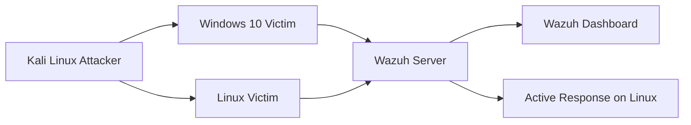

# Final SOC Lab Project Report

## 1. Project Title

SOC Lab Project Using Wazuh SIEM

## 2. Project Goal

Build a hands-on SOC lab that can:

- collect endpoint logs
- detect common attack techniques
- visualize alerts in a central dashboard
- practice basic containment through Active Response

## 3. Environment Overview

### Core Systems

- `Wazuh Server`
  - manager
  - indexer
  - dashboard
- `Windows 10 Victim`
  - Sysmon
  - Wazuh agent
- `Kali Linux Attacker`
  - brute force
  - scanning
  - payload simulation

### Upgraded Systems

- `Linux Victim`
  - SSH logging
  - Wazuh agent
  - Active Response target

## 4. Architecture

## 5. Data Sources

### Windows

- Windows Security logs
- Sysmon Operational logs

### Linux

- `/var/log/auth.log`

### Wazuh

- custom detection rules
- built-in rules and agent telemetry

## 6. Detection Use Cases Implemented

### Windows Brute Force

- Security Event ID `4625`
- alert after `5+` failures from the same source IP in `120` seconds
- MITRE: `T1110`

### Windows Port Scan

- Security Event ID `5156`
- alert after one source IP touches `10+` different destination ports in `60` seconds
- MITRE: `T1046`

### Suspicious PowerShell

- Sysmon Event ID `1`
- detect encoded, hidden, download-oriented, or bypass-style PowerShell execution
- MITRE: `T1059.001`

### Linux SSH Brute Force

- auth log failures via `sshd`
- alert after `5+` failures from the same source IP in `120` seconds
- MITRE: `T1110`

## 7. Response Capability

Active Response is configured on the Linux victim using:

- `firewall-drop`

Behavior:

- Wazuh detects repeated SSH failures
- Wazuh triggers Active Response
- the Linux victim blocks the source IP temporarily

## 8. Monitoring Dashboard

Central monitoring is performed in Wazuh with a custom dashboard:

- `SOC Lab Overview`

Recommended dashboard panels:

- alert severity overview
- top triggering rules
- alerts by agent
- Windows brute-force timeline
- Linux SSH brute-force timeline
- port-scan timeline
- suspicious PowerShell table
- top source IPs
- MITRE ATT&CK coverage
- active response events
- agent health

## 9. Incident Handling Use

The lab supports:

- detection validation
- basic alert triage
- IOC collection
- incident report creation
- containment testing

Included documentation supports:

- brute-force incident reporting
- rule development
- dashboard building
- Active Response setup

## 10. Files Delivered

- [SOC_WAZUH_LAB_GUIDE.md](/Users/subramanyasr/Documents/New%20project/SOC_WAZUH_LAB_GUIDE.md)
- [SOC_WAZUH_DETECTION_RULES.md](/Users/subramanyasr/Documents/New%20project/SOC_WAZUH_DETECTION_RULES.md)
- [WAZUH_LOCAL_RULES_BUNDLE.xml](/Users/subramanyasr/Documents/New%20project/WAZUH_LOCAL_RULES_BUNDLE.xml)
- [SOC_WAZUH_UPGRADE_AND_ACTIVE_RESPONSE_GUIDE.md](/Users/subramanyasr/Documents/New%20project/SOC_WAZUH_UPGRADE_AND_ACTIVE_RESPONSE_GUIDE.md)
- [LINUX_VICTIM_AND_ACTIVE_RESPONSE_SETUP.md](/Users/subramanyasr/Documents/New%20project/LINUX_VICTIM_AND_ACTIVE_RESPONSE_SETUP.md)
- [WAZUH_UNIFIED_DASHBOARD_GUIDE.md](/Users/subramanyasr/Documents/New%20project/WAZUH_UNIFIED_DASHBOARD_GUIDE.md)
- [WAZUH_DASHBOARD_PANEL_CHECKLIST.md](/Users/subramanyasr/Documents/New%20project/WAZUH_DASHBOARD_PANEL_CHECKLIST.md)
- [WAZUH_OSSEC_CONF_SAMPLE.xml](/Users/subramanyasr/Documents/New%20project/WAZUH_OSSEC_CONF_SAMPLE.xml)
- [SOC_LAB_SAMPLE_TEST_LOGS.md](/Users/subramanyasr/Documents/New%20project/SOC_LAB_SAMPLE_TEST_LOGS.md)
- [BRUTE_FORCE_INCIDENT_REPORT_TEMPLATE.md](/Users/subramanyasr/Documents/New%20project/BRUTE_FORCE_INCIDENT_REPORT_TEMPLATE.md)
- [security_tools/log_ip_blocker.py](/Users/subramanyasr/Documents/New%20project/security_tools/log_ip_blocker.py)

## 11. Recommended Next Steps

1. deploy the VMs and confirm connectivity
2. load [WAZUH_LOCAL_RULES_BUNDLE.xml](/Users/subramanyasr/Documents/New%20project/WAZUH_LOCAL_RULES_BUNDLE.xml) into `local_rules.xml`
3. apply [WAZUH_OSSEC_CONF_SAMPLE.xml](/Users/subramanyasr/Documents/New%20project/WAZUH_OSSEC_CONF_SAMPLE.xml) where appropriate
4. restart Wazuh services
5. generate test activity from Kali
6. validate detections with [SOC_LAB_SAMPLE_TEST_LOGS.md](/Users/subramanyasr/Documents/New%20project/SOC_LAB_SAMPLE_TEST_LOGS.md)
7. build the `SOC Lab Overview` dashboard

## 12. Conclusion

This project provides a complete beginner-to-intermediate SOC lab using Wazuh SIEM with:

- centralized monitoring
- host-based log collection
- custom detection rules
- dashboard-based visibility
- basic automated containment

It is suitable for learning SOC workflows, detection engineering, log analysis, incident response, and SIEM dashboard design in an isolated lab environment.
