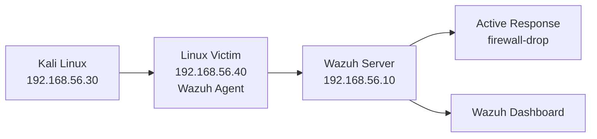

# Linux Victim and Active Response Setup

## 1. Purpose

This guide adds a `Linux victim` to the SOC lab so you can:

- detect SSH brute-force attacks
- monitor Linux authentication logs in Wazuh
- automatically block attacker IPs using Wazuh Active Response

This is the safest first automation step for the lab because Wazuh ships with built-in Linux blocking scripts.

## 2. Target Architecture



Example IPs:

- `Wazuh server`: `192.168.56.10`
- `Windows victim`: `192.168.56.20`
- `Kali attacker`: `192.168.56.30`
- `Linux victim`: `192.168.56.40`

## 3. Build the Linux Victim

Recommended OS:

- Ubuntu Server `22.04 LTS`

Recommended VM size:

- `2 vCPU`
- `2 GB RAM`
- `20-40 GB disk`

Basic host prep:

```bash
sudo apt update && sudo apt upgrade -y
sudo hostnamectl set-hostname linux-victim
ip addr
```

## 4. Install the Wazuh Agent on Linux

On the Linux victim:

```bash
curl -sO https://packages.wazuh.com/4.x/apt/wazuh-agent_4.x.x-1_amd64.deb
sudo WAZUH_MANAGER='192.168.56.10' WAZUH_AGENT_NAME='linux-victim' dpkg -i ./wazuh-agent_4.x.x-1_amd64.deb
sudo systemctl daemon-reload
sudo systemctl enable wazuh-agent
sudo systemctl start wazuh-agent
```

Confirm the agent is active:

```bash
sudo systemctl status wazuh-agent
```

Then confirm it appears in the Wazuh dashboard.

## 5. Ensure Auth Logs Are Collected

On Ubuntu, SSH failures are usually recorded in:

- `/var/log/auth.log`

Check `/var/ossec/etc/ossec.conf` on the Linux victim and make sure it contains a localfile entry for auth logs. If needed, add:

```xml
<ossec_config>
  <localfile>
    <location>/var/log/auth.log</location>
    <log_format>syslog</log_format>
  </localfile>
</ossec_config>
```

Restart the agent:

```bash
sudo systemctl restart wazuh-agent
```

## 6. Linux Brute-Force Detection Rule

Add the following custom rules on the Wazuh server in:

```text
/var/ossec/etc/rules/local_rules.xml
```

```xml
<group name="custom_linux_auth,">

  <rule id="100130" level="5">
    <if_group>syslog,sshd,authentication_failed,</if_group>
    <description>Linux SSH authentication failure from $(srcip)</description>
    <group>linux,ssh,authentication_failed,bruteforce_candidate,</group>
  </rule>

  <rule id="100131" level="12" frequency="5" timeframe="120">
    <if_matched_sid>100130</if_matched_sid>
    <same_srcip />
    <description>Possible Linux SSH brute-force attack: 5 or more failures from $(srcip) within 120 seconds</description>
    <group>linux,ssh,bruteforce,attack,</group>
    <mitre>
      <id>T1110</id>
    </mitre>
  </rule>

</group>
```

Restart the Wazuh manager:

```bash
sudo systemctl restart wazuh-manager
```

## 7. Enable Wazuh Active Response

Wazuh includes a built-in Linux active response script called `firewall-drop`, documented by Wazuh as a default active response script for Linux and Unix-like systems.

Add this block to the Wazuh server:

```text
/var/ossec/etc/ossec.conf
```

```xml
<ossec_config>
  <active-response>
    <disabled>no</disabled>
    <command>firewall-drop</command>
    <location>local</location>
    <rules_id>100131</rules_id>
    <timeout>3600</timeout>
  </active-response>
</ossec_config>
```

What this does:

- triggers when rule `100131` fires
- runs on the local agent that generated the alert
- blocks the source IP for `3600` seconds

Restart the Wazuh manager:

```bash
sudo systemctl restart wazuh-manager
```

## 8. Test the Workflow

From Kali:

```bash
hydra -l root -P /usr/share/wordlists/rockyou.txt ssh://192.168.56.40
```

Or a lighter test:

```bash
printf "admin\nroot\ntoor\npassword123\nwelcome1\n" > ssh-passwords.txt
hydra -l root -P ssh-passwords.txt ssh://192.168.56.40
```

Expected results:

- Linux auth failures appear in Wazuh
- rule `100130` matches individual failures
- rule `100131` escalates after repeated failures
- the Linux victim executes `firewall-drop`
- the Kali source IP is temporarily blocked

## 9. Verify the Block

On the Linux victim, inspect firewall rules after the alert fires:

```bash
sudo iptables -L -n
```

If your environment uses a different backend underneath, review the effective firewall state accordingly.

In the Wazuh dashboard, confirm:

- alert for Linux SSH brute force
- agent name `linux-victim`
- source IP `192.168.56.30`
- active response action associated with the event

## 10. Tuning Advice

- start with temporary blocks only
- keep the threshold at `5` or higher to reduce false positives
- exclude trusted admin IPs if necessary
- do not apply `all` location for active response in a small lab unless you are intentionally testing fleet-wide actions

## Sources

- [Default active response scripts](https://documentation.wazuh.com/current/user-manual/capabilities/active-response/default-active-response-scripts.html)
- [How to configure Active Response](https://documentation.wazuh.com/current/user-manual/capabilities/active-response/how-to-configure.html)
- [Active response configuration reference](https://documentation.wazuh.com/current/user-manual/reference/ossec-conf/active-response.html)
