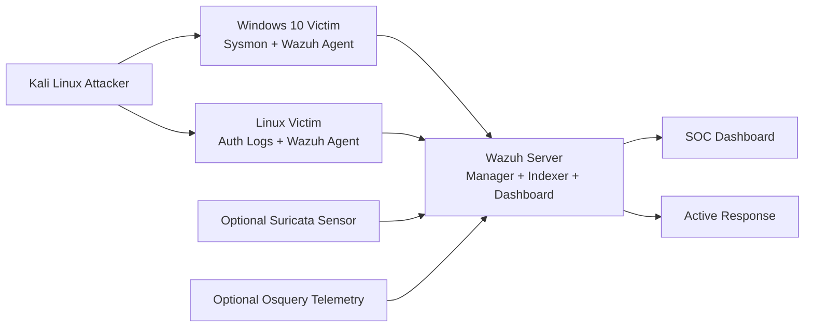

# Portfolio-Ready SOC Lab Master Document

## 1. Project Title

Advanced SOC Lab Using Wazuh SIEM

## 2. Project Summary

This project is a complete Security Operations Center lab built around `Wazuh SIEM`. It simulates a realistic blue-team environment where logs are collected from Windows and Linux systems, attacks are generated from a Kali Linux host, alerts are correlated in Wazuh, and selected threats can trigger automated containment actions.

The lab is designed to demonstrate practical skills in:

- SIEM deployment
- endpoint log collection
- detection engineering
- MITRE ATT&CK mapping
- dashboard design
- alert severity classification
- false-positive tuning
- basic incident response
- automated containment
- security operations reporting

## 3. Objectives

- deploy a working `Wazuh` SIEM lab
- collect `Windows Security`, `Sysmon`, and `Linux auth` logs
- simulate attacks from `Kali Linux`
- write custom Wazuh detections
- build a unified SOC dashboard
- apply tuning and enrichment
- enable high-confidence Active Response
- document the lab like a real SOC project

## 4. Lab Architecture

### Core Components

- `Wazuh Server`
  - Wazuh manager
  - Wazuh indexer
  - Wazuh dashboard
- `Windows 10 Victim`
  - Wazuh agent
  - Sysmon
- `Linux Victim`
  - Wazuh agent
  - auth logs
  - optional Suricata or Osquery role
- `Kali Linux Attacker`
  - brute force
  - scanning
  - payload simulation

### High-Level Architecture

### Example IP Plan

- `Wazuh Server`: `192.168.56.10`
- `Windows 10 Victim`: `192.168.56.20`
- `Kali Linux Attacker`: `192.168.56.30`
- `Linux Victim`: `192.168.56.40`

## 5. Telemetry Collected

### Windows

- Windows Security Event Logs
- Sysmon Process Creation
- Sysmon Network Connections
- Sysmon File Creation
- optional PowerShell logging

### Linux

- `/var/log/auth.log`
- optional Suricata `eve.json`
- optional Osquery scheduled results

### Wazuh Native Capabilities

- File Integrity Monitoring
- Vulnerability Detection
- Syscollector inventory
- Active Response
- custom rules
- dashboard visualizations

## 6. Attack Scenarios Simulated

### Brute Force

- Windows failed RDP or logon attempts
- Linux SSH failed logins

### Port Scanning

- `Nmap` scan from Kali against victim hosts

### Suspicious PowerShell

- encoded or hidden PowerShell execution
- PowerShell download behavior

### Malware-Like Activity

- file drop events
- harmless payload execution
- optional VirusTotal enrichment for changed files

## 7. Detection Engineering

### Custom Wazuh Detections

Implemented detections include:

- Windows brute force
- Linux SSH brute force
- Windows port scan
- suspicious PowerShell
- high-confidence PowerShell download behavior
- successful login after repeated failures

### MITRE ATT&CK Mapping

Key mappings used in the lab:

- `T1110` Brute Force
- `T1046` Network Service Discovery
- `T1059.001` PowerShell
- `T1078` Valid Accounts
- `T1105` Ingress Tool Transfer

### Sigma Rules

The project includes a portable Sigma rule pack for:

- Windows brute force
- Windows port scan visibility
- suspicious PowerShell
- Linux SSH brute force

This makes the lab more portable and demonstrates a detection engineering mindset beyond one SIEM platform.

## 8. Severity Classification

The lab standardizes alert handling using Wazuh levels and lab severity bands:

| Wazuh Level | Lab Severity | Meaning |
|---|---|---|
| `0-3` | Informational | benign or expected |
| `4-5` | Low | single low-confidence suspicious event |
| `6-9` | Medium | suspicious behavior needing validation |
| `10-12` | High | strong attack signal or correlation |
| `13-16` | Critical | high-confidence malicious activity |

Examples:

- single failed login: `Low`
- suspicious PowerShell: `Medium`
- brute-force correlation: `High`
- successful logon after repeated failures: `Critical`

## 9. False Positive Tuning

The lab includes a tuning approach for:

- trusted admin IPs
- approved vulnerability scanners
- known automation or patching accounts
- expected PowerShell administration

Tuning methods used:

- allowlists and denylists with `CDB lists`
- separate base rules and correlation rules
- lowering severity instead of full suppression where possible

## 10. Threat Enrichment

The lab supports enrichment using:

- `CDB` allowlists and denylists
- optional `VirusTotal` file hash lookups
- optional threat-intel style matching for known bad IPs or hashes

This improves triage quality and reduces time to understand alerts.

## 11. Automated Response

The lab includes a controlled Active Response design.

### Implemented Response

- Linux SSH brute force can trigger `firewall-drop`
- attacker IP is blocked temporarily on the Linux victim

### Response Philosophy

- only high-confidence detections should auto-block
- use temporary blocks first
- protect trusted admin or scanner IPs with allowlists

## 12. Unified Monitoring Dashboard

The lab uses Wazuh as a central monitoring dashboard.

### Dashboard Coverage

- alert severity overview
- top triggering rules
- alerts by agent
- Windows brute-force timeline
- Linux SSH brute-force timeline
- port-scan timeline
- suspicious PowerShell events
- top source IPs
- MITRE ATT&CK coverage
- vulnerability exposure
- file integrity changes
- Active Response actions
- agent health
- optional Suricata network alerts

This gives a single-pane SOC view for the entire lab.

## 13. Advanced Upgrades Implemented

The advanced version of the lab includes:

- File Integrity Monitoring
- Vulnerability Detection
- Syscollector inventory
- VirusTotal integration sample
- CDB-based enrichment
- advanced correlation rules
- Suricata integration guide
- Osquery integration guide
- case management workflow
- dashboard v2 design

## 14. Incident Response Workflow

The lab supports a basic SOC workflow:

1. detect
2. triage
3. investigate
4. contain
5. recover
6. document

Included reporting support:

- brute-force incident report template
- IOC tracking
- timeline documentation
- remediation tracking

## 15. Resource Requirements

### Minimum Usable Host

- `16 GB RAM`
- `6+ CPU threads`
- SSD preferred

### Recommended Host

- `24-32 GB RAM`
- `8+ CPU threads`
- SSD storage

### Suggested VM Allocation

- `Wazuh`: `8-16 GB RAM`
- `Windows 10`: `4-6 GB RAM`
- `Linux Victim`: `2-4 GB RAM`
- `Kali`: `2-4 GB RAM`
- optional Suricata sensor: `4 GB RAM`

## 16. Project Deliverables

### Core Guides

- [SOC_WAZUH_LAB_GUIDE.md](/Users/subramanyasr/Documents/New%20project/SOC_WAZUH_LAB_GUIDE.md)
- [FINAL_SOC_LAB_PROJECT_REPORT.md](/Users/subramanyasr/Documents/New%20project/FINAL_SOC_LAB_PROJECT_REPORT.md)
- [ALL_UPGRADES_IMPLEMENTATION_GUIDE.md](/Users/subramanyasr/Documents/New%20project/ALL_UPGRADES_IMPLEMENTATION_GUIDE.md)

### Rules and Detection Engineering

- [SOC_WAZUH_DETECTION_RULES.md](/Users/subramanyasr/Documents/New%20project/SOC_WAZUH_DETECTION_RULES.md)
- [WAZUH_LOCAL_RULES_BUNDLE.xml](/Users/subramanyasr/Documents/New%20project/WAZUH_LOCAL_RULES_BUNDLE.xml)
- [WAZUH_LOCAL_RULES_BUNDLE_V2.xml](/Users/subramanyasr/Documents/New%20project/WAZUH_LOCAL_RULES_BUNDLE_V2.xml)
- [WAZUH_ADVANCED_CORRELATION_RULES.xml](/Users/subramanyasr/Documents/New%20project/WAZUH_ADVANCED_CORRELATION_RULES.xml)
- [SIGMA_RULE_PACK.yml](/Users/subramanyasr/Documents/New%20project/SIGMA_RULE_PACK.yml)

### Config Samples

- [WAZUH_OSSEC_CONF_SAMPLE.xml](/Users/subramanyasr/Documents/New%20project/WAZUH_OSSEC_CONF_SAMPLE.xml)
- [WAZUH_FIM_CONFIG_SAMPLE.xml](/Users/subramanyasr/Documents/New%20project/WAZUH_FIM_CONFIG_SAMPLE.xml)
- [WAZUH_VULNERABILITY_DETECTION_CONFIG.xml](/Users/subramanyasr/Documents/New%20project/WAZUH_VULNERABILITY_DETECTION_CONFIG.xml)
- [WAZUH_SYSCOLLECTOR_AGENT_CONFIG.xml](/Users/subramanyasr/Documents/New%20project/WAZUH_SYSCOLLECTOR_AGENT_CONFIG.xml)
- [WAZUH_VIRUSTOTAL_INTEGRATION_SAMPLE.xml](/Users/subramanyasr/Documents/New%20project/WAZUH_VIRUSTOTAL_INTEGRATION_SAMPLE.xml)

### Operations and Reporting

- [WAZUH_UNIFIED_DASHBOARD_GUIDE.md](/Users/subramanyasr/Documents/New%20project/WAZUH_UNIFIED_DASHBOARD_GUIDE.md)
- [WAZUH_DASHBOARD_PANEL_CHECKLIST.md](/Users/subramanyasr/Documents/New%20project/WAZUH_DASHBOARD_PANEL_CHECKLIST.md)
- [SOC_DASHBOARD_V2_GUIDE.md](/Users/subramanyasr/Documents/New%20project/SOC_DASHBOARD_V2_GUIDE.md)
- [ALERT_SEVERITY_CLASSIFICATION_MATRIX.md](/Users/subramanyasr/Documents/New%20project/ALERT_SEVERITY_CLASSIFICATION_MATRIX.md)
- [FALSE_POSITIVE_TUNING_GUIDE.md](/Users/subramanyasr/Documents/New%20project/FALSE_POSITIVE_TUNING_GUIDE.md)
- [CASE_MANAGEMENT_AND_PLAYBOOKS.md](/Users/subramanyasr/Documents/New%20project/CASE_MANAGEMENT_AND_PLAYBOOKS.md)
- [BRUTE_FORCE_INCIDENT_REPORT_TEMPLATE.md](/Users/subramanyasr/Documents/New%20project/BRUTE_FORCE_INCIDENT_REPORT_TEMPLATE.md)

### Supporting Modules

- [LINUX_VICTIM_AND_ACTIVE_RESPONSE_SETUP.md](/Users/subramanyasr/Documents/New%20project/LINUX_VICTIM_AND_ACTIVE_RESPONSE_SETUP.md)
- [SURICATA_INTEGRATION_GUIDE.md](/Users/subramanyasr/Documents/New%20project/SURICATA_INTEGRATION_GUIDE.md)
- [OSQUERY_INTEGRATION_GUIDE.md](/Users/subramanyasr/Documents/New%20project/OSQUERY_INTEGRATION_GUIDE.md)
- [WAZUH_CDB_LISTS_AND_ENRICHMENT.md](/Users/subramanyasr/Documents/New%20project/WAZUH_CDB_LISTS_AND_ENRICHMENT.md)
- [SOC_LAB_SAMPLE_TEST_LOGS.md](/Users/subramanyasr/Documents/New%20project/SOC_LAB_SAMPLE_TEST_LOGS.md)
- [security_tools/log_ip_blocker.py](/Users/subramanyasr/Documents/New%20project/security_tools/log_ip_blocker.py)

## 17. Key Outcomes

This project demonstrates the ability to:

- design a SOC lab architecture
- deploy and configure Wazuh
- collect multi-platform logs
- write SIEM detections
- map detections to MITRE ATT&CK
- classify and tune alerts
- enrich detections with threat context
- automate containment safely
- build analyst dashboards
- document investigations and remediation

## 18. Recommended Portfolio Description

`Built an advanced SOC lab using Wazuh SIEM with Windows, Linux, and Kali Linux systems. Implemented custom detections for brute force, port scanning, suspicious PowerShell, and attack-chain correlation; mapped alerts to MITRE ATT&CK; created Sigma rules, severity classification, false-positive tuning, dashboard visualizations, and Active Response automation for high-confidence threats.`

## 19. Final Conclusion

This SOC lab project goes beyond basic SIEM deployment and demonstrates a full security operations workflow:

- telemetry collection
- threat detection
- alert tuning
- threat enrichment
- response automation
- case documentation
- centralized dashboard monitoring

It is suitable as a portfolio project for SOC analyst, detection engineer, blue team, or junior security engineering roles.
