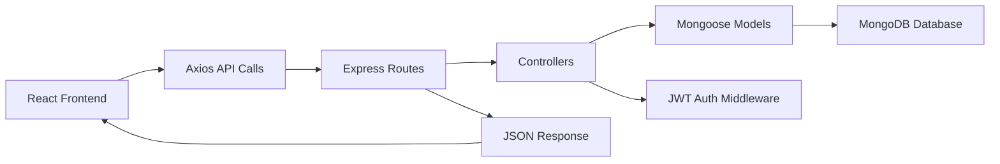

# EchoMateLite Project Documentation

## 1. Project Overview

EchoMateLite is a lightweight social media platform built with the MERN stack.
It allows users to:

- create an account
- log in securely
- manage their profile
- create posts with text and optional images
- browse a reverse-chronological feed
- like posts
- comment on posts
- edit and delete their own posts
- search users
- view public profiles
- follow and unfollow other users

This project was designed as a clean, beginner-friendly, production-oriented full-stack application using React, Node.js, Express, and MongoDB.

## 2. Objectives

The main goals of the project are:

- implement secure JWT-based authentication
- use MongoDB with Mongoose for structured data management
- provide a clean Tailwind CSS user interface
- follow a maintainable backend MVC structure
- prepare the application for deployment and future feature growth

## 3. Tech Stack

### Frontend

- React.js
- React Router DOM
- Axios
- Tailwind CSS
- Vite

### Backend

- Node.js
- Express.js
- MongoDB
- Mongoose
- JWT
- bcrypt
- dotenv
- cors
- morgan

## 4. Final Folder Structure

```text
New project/
├── PROJECT_DOCUMENTATION.md
├── README.md
├── client/
│   ├── .env
│   ├── .env.example
│   ├── index.html
│   ├── package.json
│   ├── postcss.config.js
│   ├── tailwind.config.js
│   ├── vite.config.js
│   └── src/
│       ├── App.jsx
│       ├── api/
│       │   └── axiosInstance.js
│       ├── components/
│       │   ├── EmptyState.jsx
│       │   ├── Loader.jsx
│       │   ├── Navbar.jsx
│       │   ├── PostCard.jsx
│       │   ├── PostComposer.jsx
│       │   ├── ProtectedRoute.jsx
│       │   ├── SkeletonCard.jsx
│       │   └── ToastViewport.jsx
│       ├── context/
│       │   ├── AuthContext.jsx
│       │   └── ToastContext.jsx
│       ├── index.css
│       ├── main.jsx
│       └── pages/
│           ├── DashboardPage.jsx
│           ├── LoginPage.jsx
│           ├── ProfilePage.jsx
│           ├── PublicProfilePage.jsx
│           └── SignupPage.jsx
└── server/
    ├── .env
    ├── .env.example
    ├── config/
    │   └── db.js
    ├── controllers/
    │   ├── authController.js
    │   ├── postController.js
    │   └── profileController.js
    ├── middleware/
    │   ├── authMiddleware.js
    │   └── errorMiddleware.js
    ├── models/
    │   ├── Post.js
    │   └── User.js
    ├── routes/
    │   ├── authRoutes.js
    │   ├── postRoutes.js
    │   └── profileRoutes.js
    ├── utils/
    │   ├── generateToken.js
    │   └── validators.js
    ├── package-lock.json
    ├── package.json
    └── server.js
```

## 5. Architecture

EchoMateLite follows a typical MERN architecture with separate frontend and backend applications.

### High-Level Flow

1. The user interacts with the React frontend.
2. The frontend sends HTTP requests using Axios.
3. The Express backend receives requests through REST APIs.
4. Middleware validates tokens and protects private routes.
5. Controllers process requests and interact with MongoDB through Mongoose models.
6. The backend returns JSON responses to the frontend.
7. The frontend updates the UI based on the response.

### Architecture Diagram



## 6. Backend Design

The backend is organized using MVC principles.

### Models

#### User Model

Stores:

- username
- email
- password
- name
- bio
- profilePicture
- followers
- following

#### Post Model

Stores:

- user reference
- text
- imageUrl
- likes
- comments
- editedAt
- timestamps

### Controllers

#### `authController.js`

Handles:

- signup
- login
- password hashing
- JWT creation

#### `postController.js`

Handles:

- get all posts
- create post
- update post
- delete post
- like and unlike post
- add comment
- delete comment
- feed filtering
- search integration

#### `profileController.js`

Handles:

- get logged-in profile
- update profile
- get public profile by username
- search users
- follow and unfollow users

### Middleware

#### `authMiddleware.js`

Checks:

- authorization header exists
- JWT is valid
- user exists in database

#### `errorMiddleware.js`

Handles:

- missing routes
- server-side errors

## 7. Frontend Design

The frontend is built with React functional components and hooks.

### Main Pages

#### Login Page

Features:

- email and password input
- client-side validation
- login request
- loading state
- error state

#### Signup Page

Features:

- username, email, password input
- validation
- account creation
- loading state
- error state

#### Dashboard Page

Features:

- post creation
- image URL or uploaded image support
- feed tabs
- search
- user suggestions
- like/comment/edit/delete actions

#### Profile Page

Features:

- edit display name
- edit bio
- edit profile picture
- preview profile card
- view own posts

#### Public Profile Page

Features:

- view another user's profile
- follow or unfollow
- see user stats
- browse that user's posts

### Reusable Components

- `Navbar`
- `PostCard`
- `PostComposer`
- `ProtectedRoute`
- `ToastViewport`
- `EmptyState`
- `SkeletonCard`

## 8. Authentication Flow

### Signup Flow

1. User enters username, email, and password.
2. Frontend sends request to `POST /auth/signup`.
3. Backend validates input.
4. Password is hashed with bcrypt.
5. User is saved in MongoDB.
6. JWT is generated and returned.
7. Frontend stores token in `localStorage`.

### Login Flow

1. User enters email and password.
2. Frontend sends request to `POST /auth/login`.
3. Backend finds the user by email.
4. bcrypt compares passwords.
5. JWT is generated if valid.
6. Frontend stores token in `localStorage`.

### Protected Route Flow

1. Frontend sends token in `Authorization: Bearer <token>`.
2. Backend middleware verifies the token.
3. If valid, request continues.
4. If invalid, request returns `401 Unauthorized`.

## 9. REST API Documentation

## Authentication APIs

### `POST /auth/signup`

Request body:

```json
{
  "username": "john_doe",
  "email": "john@example.com",
  "password": "123456"
}
```

### `POST /auth/login`

Request body:

```json
{
  "email": "john@example.com",
  "password": "123456"
}
```

## Profile APIs

### `GET /profile`

Returns the logged-in user's profile.

### `PUT /profile`

Request body:

```json
{
  "name": "John Doe",
  "bio": "Full-stack developer",
  "profilePicture": "https://example.com/profile.jpg"
}
```

### `GET /profile/search?query=john`

Search users by username, name, or bio.

### `GET /profile/:username`

Returns a public profile and the user’s posts.

### `POST /profile/:username/follow`

Follows or unfollows a user.

## Post APIs

### `GET /posts`

Fetch all posts in reverse chronological order.

Optional query params:

- `scope=all`
- `scope=following`
- `scope=mine`
- `query=searchText`

### `POST /posts`

Request body:

```json
{
  "text": "Hello EchoMateLite!",
  "imageUrl": "https://example.com/post.jpg"
}
```

### `PUT /posts/:id`

Update a post created by the logged-in user.

### `DELETE /posts/:id`

Delete a post created by the logged-in user.

### `POST /posts/:id/like`

Like or unlike a post.

### `POST /posts/:id/comments`

Request body:

```json
{
  "text": "Nice post!"
}
```

### `DELETE /posts/:id/comments/:commentId`

Delete a comment.

## 10. Database Schema Summary

### User

```js
{
  username: String,
  email: String,
  password: String,
  name: String,
  bio: String,
  profilePicture: String,
  followers: [ObjectId],
  following: [ObjectId]
}
```

### Post

```js
{
  user: ObjectId,
  text: String,
  imageUrl: String,
  likes: [ObjectId],
  comments: [
    {
      user: ObjectId,
      text: String,
      createdAt: Date
    }
  ],
  editedAt: Date
}
```

## 11. Security Implementation

Security decisions included:

- bcrypt password hashing
- JWT authentication
- protected backend routes
- environment variables for secrets
- input validation for email, passwords, URLs, bio length, comment length, and post length
- frontend session clearing on unauthorized responses

## 12. UI and UX Improvements Added

Compared to the original MVP, the following usability improvements were added:

- better login/signup validation
- toast notifications
- loading skeletons
- empty states
- post editing
- comments
- public profiles
- follow/unfollow
- search
- mobile-friendly layout improvements
- cleaner dashboard and profile layouts

## 13. Installation Steps

### Backend

```bash
cd "/Users/subramanyasr/Documents/New project/server"
npm install
```

Create `.env`:

```env
PORT=5001
MONGODB_URI=mongodb://127.0.0.1:27017/echomatelite
JWT_SECRET=echomatelite_dev_secret_change_me_2026
CLIENT_URL=http://localhost:5173
```

### Frontend

```bash
cd "/Users/subramanyasr/Documents/New project/client"
npm install
```

Create `.env`:

```env
VITE_API_BASE_URL=http://localhost:5001
```

### MongoDB

```bash
brew tap mongodb/brew
brew install mongodb-community
brew services start mongodb-community
```

## 14. Run Commands

### Start backend

```bash
cd "/Users/subramanyasr/Documents/New project/server"
npm run dev
```

### Start frontend

```bash
cd "/Users/subramanyasr/Documents/New project/client"
npm run dev
```

## 15. Build Verification

Frontend production build was verified using:

```bash
cd "/Users/subramanyasr/Documents/New project/client"
npm run build
```

Backend modules were syntax-checked by loading route and controller files through Node.

## 16. Step-by-Step Development Summary

### Step 1. Initial Setup

- created separate `server` and `client` folders
- initialized backend dependencies
- initialized frontend with Vite and React
- added Tailwind CSS

### Step 2. Backend MVP

- created User and Post models
- set up MongoDB connection
- created auth routes
- created profile routes
- created post routes
- added JWT middleware

### Step 3. Frontend MVP

- built signup page
- built login page
- built dashboard
- built profile page
- added localStorage token handling
- connected frontend with Axios

### Step 4. Version 2 Enhancements

- added likes
- added comments
- added edit/delete post
- added public profile page
- added follow system
- added search
- added toast notifications
- added skeleton loaders
- added better UI styling and UX polish

## 17. Challenges and Solutions

### Challenge 1. Port `5000` already in use

Solution:

- moved backend to port `5001`
- updated frontend API base URL

### Challenge 2. MongoDB not installed initially

Solution:

- installed `mongodb-community` using Homebrew
- started MongoDB service

### Challenge 3. Sandboxed environment could not fully run local ports

Solution:

- performed code generation and verification in workspace
- completed runtime checks on the local machine through terminal

## 18. AWS Deployment Readiness Notes

The project is reasonably prepared for AWS deployment because:

- backend uses environment variables
- frontend uses environment-specific API URL
- CORS is configurable
- production build exists for frontend
- backend start script exists

For AWS, recommended deployment path:

- frontend: S3 + CloudFront or Vercel/Netlify equivalent
- backend: EC2, Elastic Beanstalk, or ECS
- database: MongoDB Atlas
- images: S3 or Cloudinary for real file storage

Additional AWS preparation tasks:

- move image upload from data URL to S3 or Cloudinary
- add rate limiting
- add helmet security middleware
- add centralized logging
- add refresh token strategy if needed
- add proper production error monitoring

## 19. Future Enhancements

Suggested next improvements:

- real image uploads with cloud storage
- notifications
- post bookmarking
- dark mode
- pagination or infinite scroll
- admin moderation tools
- password reset flow
- email verification
- unit and integration tests

## 20. Conclusion

EchoMateLite successfully demonstrates a full-stack MERN social platform with modern frontend practices, clean backend structure, secure authentication, and an upgraded user experience.

The application is functional, extensible, and ready to be documented further for academic submission, portfolio use, or AWS deployment planning.
