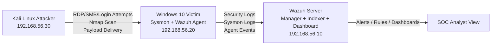
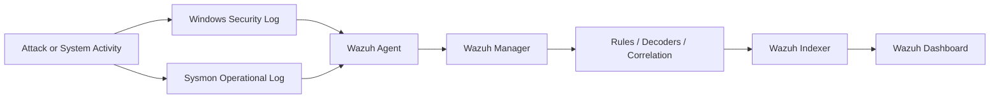

# SOC Lab Project Using Wazuh SIEM

## 1. Project Overview

This lab simulates a small Security Operations Center environment with three core systems:

- `Wazuh Server`: central SIEM for log collection, correlation, alerting, and investigation
- `Windows 10 Victim`: monitored endpoint running Sysmon and the Wazuh agent
- `Kali Linux Attacker`: offensive host used to generate realistic attack telemetry

The goal is to build a safe home or classroom SOC lab where you can:

- deploy Wazuh as the SIEM platform
- onboard a Windows endpoint
- collect Windows event logs and Sysmon telemetry
- simulate basic attacks
- investigate alerts in the Wazuh dashboard

## 2. Lab Objectives

- understand Wazuh architecture and host onboarding
- forward Windows and Sysmon events into the SIEM
- generate detection data from attacker activity
- observe alert creation, rule matching, and analyst workflow
- practice incident triage with a small but complete SOC environment

## 3. Recommended Platform

You can run this lab in VirtualBox, VMware Workstation, or Proxmox.

Recommended VM sizing:

- `Wazuh Server`
  - 4 vCPU
  - 8 GB RAM minimum
  - 80 GB disk
  - Ubuntu Server 22.04 LTS
- `Windows 10 Victim`
  - 2 vCPU
  - 4 GB RAM minimum
  - 60 GB disk
- `Kali Linux Attacker`
  - 2 vCPU
  - 4 GB RAM
  - 40 GB disk

## 4. Network Architecture

Use a private host-only or internal virtual network so the lab remains isolated.

Example subnet:

- `Wazuh Server`: `192.168.56.10`
- `Windows 10 Victim`: `192.168.56.20`
- `Kali Linux Attacker`: `192.168.56.30`
- Subnet: `192.168.56.0/24`

### Architecture Diagram



### Port Considerations

- `1514/tcp or udp`: Wazuh agent event transport
- `1515/tcp`: Wazuh agent enrollment
- `55000/tcp`: Wazuh API
- `443/tcp`: Wazuh web dashboard

## 5. Components and Roles

### Wazuh Server

The Wazuh server includes:

- Wazuh manager for event analysis and rule matching
- Wazuh indexer for indexed storage and search
- Wazuh dashboard for analyst visualization

### Windows 10 Victim

This machine generates:

- Windows Security event logs
- Sysmon logs for process creation, network connections, image loads, and file activity
- Wazuh agent events for forwarding and endpoint visibility

### Kali Linux Attacker

This machine is used to simulate:

- brute-force login attempts
- network reconnaissance and port scanning
- malware or suspicious payload delivery in a controlled way

## 6. Step-by-Step Setup Guide

## Step 1: Build the Virtual Machines

Create three VMs:

1. Ubuntu Server for Wazuh
2. Windows 10 for the monitored endpoint
3. Kali Linux for the attacker

Attach all three to the same isolated lab network.

Assign static IP addresses or DHCP reservations so the addresses do not change.

## Step 2: Install the Wazuh Server

Log in to the Ubuntu server and update packages:

```bash
sudo apt update && sudo apt upgrade -y
sudo timedatectl set-timezone Asia/Kolkata
```

Install Wazuh using the official all-in-one assisted installer:

```bash
curl -sO https://packages.wazuh.com/4.7/wazuh-install.sh
curl -sO https://packages.wazuh.com/4.7/config.yml
sudo bash wazuh-install.sh -a
```

What this does:

- installs the Wazuh indexer
- installs the Wazuh manager
- installs the Wazuh dashboard
- configures certificates and service integration

After installation:

```bash
sudo systemctl status wazuh-manager
sudo systemctl status wazuh-indexer
sudo systemctl status wazuh-dashboard
```

Save the generated dashboard credentials shown by the installer.

Access the dashboard:

```text
https://192.168.56.10
```

If the web interface does not load, allow firewall access:

```bash
sudo ufw allow 1514/tcp
sudo ufw allow 1515/tcp
sudo ufw allow 443/tcp
sudo ufw enable
```

## Step 3: Prepare the Windows 10 Victim

On Windows 10:

1. Install all basic updates
2. Set a static IP such as `192.168.56.20`
3. Rename the host to something clear, such as `WIN10-VICTIM`
4. Create a normal local user and an administrative test user
5. Enable Remote Desktop if you want to simulate remote login attacks

Optional but useful:

- enable file sharing for SMB-related event generation
- create a test folder like `C:\LabFiles`

## Step 4: Install Sysmon on Windows 10

Download Sysmon from Microsoft Sysinternals.

Open PowerShell as Administrator and install Sysmon with a solid community config, for example SwiftOnSecurity's Sysmon configuration:

```powershell
Sysmon64.exe -accepteula -i sysmonconfig-export.xml
```

Verify Sysmon is installed:

```powershell
Get-Service Sysmon64
```

Sysmon logs will appear in:

- `Applications and Services Logs/Microsoft/Windows/Sysmon/Operational`

Useful Sysmon events in this lab:

- `Event ID 1`: process creation
- `Event ID 3`: network connection
- `Event ID 7`: image loaded
- `Event ID 11`: file creation
- `Event ID 13`: registry value set

## Step 5: Install the Wazuh Agent on Windows 10

From the Wazuh dashboard:

1. Go to agent management
2. Add a new agent
3. Choose Windows
4. Copy the generated installation command

Example PowerShell installation flow:

```powershell
Invoke-WebRequest -Uri https://packages.wazuh.com/4.x/windows/wazuh-agent-4.x.x-1.msi -OutFile wazuh-agent.msi
msiexec.exe /i wazuh-agent.msi /q WAZUH_MANAGER='192.168.56.10' WAZUH_AGENT_NAME='WIN10-VICTIM'
```

Start the service:

```powershell
NET START WazuhSvc
```

Confirm the agent appears in the Wazuh dashboard as active.

## Step 6: Configure the Agent to Collect Sysmon Logs

Edit the Wazuh agent configuration file on Windows:

```text
C:\Program Files (x86)\ossec-agent\ossec.conf
```

Make sure it collects both Security and Sysmon logs:

```xml
<ossec_config>
  <localfile>
    <location>Security</location>
    <log_format>eventchannel</log_format>
  </localfile>

  <localfile>
    <location>Microsoft-Windows-Sysmon/Operational</location>
    <log_format>eventchannel</log_format>
  </localfile>

  <localfile>
    <location>System</location>
    <log_format>eventchannel</log_format>
  </localfile>
</ossec_config>
```

Restart the agent:

```powershell
Restart-Service WazuhSvc
```

## Step 7: Verify Log Ingestion

In the Wazuh dashboard:

1. Open the agents section and confirm the Windows host is connected
2. Open the security events or threat hunting views
3. Filter by the Windows agent name
4. Confirm you can see:
   - Windows login events
   - Sysmon process creation events
   - network activity events

Quick Windows activity to generate test logs:

```powershell
whoami
ipconfig
notepad.exe
cmd.exe /c dir C:\
```

These should create telemetry visible through Sysmon and the Wazuh agent.

## Step 8: Prepare the Kali Linux Attacker

On Kali:

```bash
sudo apt update && sudo apt upgrade -y
ip addr
```

Confirm connectivity:

```bash
ping 192.168.56.20
ping 192.168.56.10
```

Common tools used in the lab:

- `nmap`
- `hydra`
- `xfreerdp` or another RDP client
- `smbclient`
- `python3`

## 7. Log Flow Explanation

This is the core telemetry path in the lab:

1. An event happens on the Windows 10 machine.
2. Windows records native Security events and Sysmon records enhanced endpoint telemetry.
3. The Wazuh agent reads those event channels locally.
4. The Wazuh agent forwards the events to the Wazuh manager on the server.
5. The Wazuh manager decodes the events and evaluates them against built-in rules.
6. Matching alerts are written to indexed storage in the Wazuh indexer.
7. The Wazuh dashboard displays the alerts for analysis, filtering, and investigation.

### Log Flow Diagram



### What the Analyst Should See

- source host and agent name
- event timestamp
- event ID and log channel
- destination IP or source IP
- process name, command line, or file path
- alert rule description and severity level

## 8. Sample Attacks to Simulate

Only perform these attacks in your isolated lab.

## A. Brute Force Simulation

### Goal

Generate repeated authentication failures from Kali toward Windows.

### Methods

You can simulate this against:

- RDP
- SMB
- local login prompts exposed through remote services

### Example Using Hydra Against RDP

```bash
hydra -l administrator -P /usr/share/wordlists/rockyou.txt rdp://192.168.56.20
```

If you want a lighter test, create a small password list:

```bash
printf "Password123\nWelcome123\nAdmin123\nWinter2024!\n" > passwords.txt
hydra -l administrator -P passwords.txt rdp://192.168.56.20
```

### Expected Windows/Wazuh Evidence

- multiple failed login events
- repeated source IP from `192.168.56.30`
- possible account lockout if policy is enabled

Relevant Windows event IDs:

- `4625`: failed logon
- `4624`: successful logon if credentials are guessed correctly
- `4740`: account locked out

Relevant analyst checks:

- count of failures over time
- same username targeted repeatedly
- same source IP targeting one or more accounts

## B. Port Scan Simulation

### Goal

Generate reconnaissance traffic and network connection visibility.

### Example Nmap SYN Scan

```bash
sudo nmap -sS -Pn 192.168.56.20
```

### Example Version Detection Scan

```bash
sudo nmap -sV -O 192.168.56.20
```

### Expected Evidence

- inbound connection attempts to multiple ports
- Windows Defender Firewall events, if enabled and logging
- Sysmon network connection activity depending on host behavior and config
- Wazuh alerts for suspicious scanning patterns if rules match collected events

Best practice:

- enable Windows Firewall logging
- collect Sysmon Event ID `3`
- compare scan timestamps with alert timelines in Wazuh

## C. Malware or Suspicious Payload Simulation

### Goal

Generate safe process creation and file creation telemetry that resembles malware behavior without using real malicious code.

### Safe Option 1: EICAR Test File

On Windows, create the EICAR test string in a text file or download it from the official EICAR site in the lab.

Expected evidence:

- file creation events
- antivirus detection events
- possible Windows Defender alerts
- Wazuh alerts if integrated rules match

### Safe Option 2: Fake Payload Execution

From Kali, host a harmless file:

```bash
cd /tmp
python3 -m http.server 8080
```

On Windows, download it:

```powershell
Invoke-WebRequest -Uri http://192.168.56.30:8080/test.exe -OutFile C:\LabFiles\test.exe
Start-Process C:\LabFiles\test.exe
```

Use a harmless executable such as a renamed admin tool or a simple test binary you created yourself.

Expected Sysmon evidence:

- `Event ID 1`: process creation
- `Event ID 3`: network connection
- `Event ID 11`: file creation

Analyst pivot points:

- parent process
- command line
- downloaded file path
- remote host `192.168.56.30`

## 9. Suggested Detection Use Cases

Create detection scenarios around:

- excessive failed logons from one source IP
- new or unusual processes launched from `Downloads` or `C:\LabFiles`
- suspicious command interpreters such as `cmd.exe` or `powershell.exe`
- unexpected outbound connections to the Kali host
- file creation followed by immediate execution

## 10. Basic Investigation Workflow

When an alert appears in Wazuh:

1. identify the affected agent
2. check the rule description and level
3. inspect source IP, username, process name, and command line
4. pivot to related events around the same timestamp
5. determine whether the event was expected lab activity
6. document findings and tune rules if needed

## 11. Hardening and Tuning Ideas

Once the basic lab works, improve it with:

- Windows audit policy tuning
- account lockout policy for brute-force testing
- custom Wazuh rules for your Kali IP
- firewall logging
- PowerShell operational logging
- FIM on sensitive directories
- active response in a tightly controlled environment

## 12. Deliverables Summary

This SOC lab project includes:

1. `Wazuh SIEM server` as the centralized detection and analysis platform
2. `Windows 10 victim` with Sysmon and the Wazuh agent for high-value endpoint telemetry
3. `Kali Linux attacker` for realistic attack simulation
4. step-by-step setup instructions
5. network architecture and log flow
6. sample attack simulations for brute force, port scanning, and malware-like behavior

## 13. Final Notes

- keep the lab isolated from production and personal devices
- never run real malware in this environment
- use snapshots so you can quickly reset the Windows endpoint after exercises
- document your findings like a SOC analyst after each attack simulation

This lab is small enough to run on a laptop but complete enough to practice collection, detection, and triage with Wazuh.
