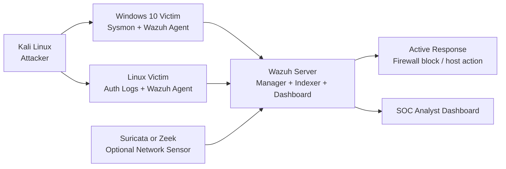

# SOC Wazuh Upgrade and Active Response Guide

## 1. Can Everything Run Simultaneously?

Yes. In a normal SOC lab, these components run at the same time:

- `Wazuh server`
- `Windows 10 victim` with `Sysmon` and `Wazuh agent`
- `Kali Linux attacker`
- optional helper tools such as custom Python scripts

### Normal Runtime Flow

1. the `Windows` host generates security and Sysmon logs
2. the `Wazuh agent` forwards logs to the `Wazuh manager`
3. the `Wazuh manager` evaluates rules and creates alerts
4. the `Wazuh dashboard` displays events and detections
5. the `Kali` host generates test attacks when needed
6. `Active Response` can optionally block or drop suspicious IP addresses

This is the intended operating model for the lab.

## 2. Recommended Upgraded Architecture

The current lab is good for a beginner SOC. The next upgrade is to move from a basic endpoint-only lab into a small detection engineering environment.

### Recommended Upgrade Layout



### Best Upgrades to Add

- add a `Linux victim`
  - useful for SSH brute-force detection
  - useful for Linux log analysis and firewall-based response
- enable `PowerShell Operational Logging`
  - gives more depth than Sysmon alone for script investigations
- add `Suricata` or `Zeek`
  - provides network-level evidence for scans, C2, and suspicious flows
- add a second Windows endpoint
  - useful for lateral movement and multi-host investigations
- create custom dashboards
  - separate views for brute force, PowerShell, and reconnaissance alerts
- add `Wazuh Active Response`
  - supports automatic containment for selected detections

## 3. Resource Sizing Plan

Performance depends mainly on RAM, CPU, and whether the Wazuh indexer is under pressure.

### Minimum Usable Lab

- Host machine:
  - `16 GB RAM`
  - `6+ CPU threads`
  - `150+ GB free disk`

- VM allocation:
  - `Wazuh`: `4 vCPU`, `8 GB RAM`
  - `Windows 10`: `2 vCPU`, `4 GB RAM`
  - `Kali`: `2 vCPU`, `2-4 GB RAM`

This will run, but indexing and dashboard performance may feel slow during bursts.

### Recommended Comfortable Lab

- Host machine:
  - `24-32 GB RAM`
  - `8+ CPU threads`
  - SSD storage

- VM allocation:
  - `Wazuh`: `6-8 vCPU`, `12-16 GB RAM`
  - `Windows 10`: `2-4 vCPU`, `4-6 GB RAM`
  - `Kali`: `2 vCPU`, `4 GB RAM`
  - optional `Linux victim`: `2 vCPU`, `2 GB RAM`
  - optional `Suricata/Zeek`: `2-4 vCPU`, `4 GB RAM`

### Wazuh-Specific Notes

According to the current Wazuh documentation, the Wazuh indexer hardware recommendations per node are:

- minimum: `2 CPU`, `4 GB RAM`
- recommended: `8 CPU`, `16 GB RAM`

For this lab, a single all-in-one Wazuh VM is acceptable, but once you add more endpoints or network telemetry, the Wazuh VM should be the first thing you scale up.

### If Resources Are Tight

- keep the `Wazuh server` on at all times
- keep the `Windows victim` on while testing detections
- boot `Kali` only during attack simulation
- add `Suricata/Zeek` later
- snapshot VMs to reset quickly instead of rebuilding

## 4. Active Response Design

### What Active Response Does

Wazuh Active Response executes a command or script when a rule, rule group, or alert level is triggered.

From current Wazuh documentation:

- default scripts exist out of the box
- actions can run on the local agent, on the server, on a defined agent, or on all agents
- a timeout can be applied so blocks are temporary

### Good Use Cases in This Lab

- block brute-force source IPs on a Linux endpoint using `firewall-drop`
- trigger a custom response script on a Windows endpoint
- send a response to a dedicated edge firewall host if you later add one

### Important Caution

For this lab, use Active Response only for:

- high-confidence brute-force detections
- test environments
- temporary blocks with timeouts

Do not start with aggressive automatic blocking for broad detections like generic PowerShell or noisy scan rules.

## 5. Recommended Active Response Strategy for Your Lab

### Phase 1: Safe Starting Point

Use Active Response only on the `Linux victim` for brute-force attempts.

Why:

- Wazuh includes a default `firewall-drop` script for Linux and Unix-like systems
- Linux firewall blocking is simpler to test than Windows custom response binaries
- this gives you safe automation without needing to write a Windows executable first

### Phase 2: Expand Carefully

Later you can:

- create a custom Windows response executable
- trigger a block on a central firewall host
- call a hardened version of your Python IP blocking workflow from an Active Response script

## 6. Example Active Response Configuration

The following is the common pattern from Wazuh’s current documentation for enabling Active Response based on a rule ID.

Add an `active-response` block to:

```text
/var/ossec/etc/ossec.conf
```

Example using the built-in Linux `firewall-drop` command:

```xml
<ossec_config>
  <active-response>
    <disabled>no</disabled>
    <command>firewall-drop</command>
    <location>local</location>
    <rules_id>100101</rules_id>
    <timeout>3600</timeout>
  </active-response>
</ossec_config>
```

### What this does

- `command`: uses the built-in firewall block script
- `location local`: runs on the agent that generated the event
- `rules_id 100101`: links to the brute-force rule from your custom rule pack
- `timeout 3600`: keeps the block active for one hour

After editing:

```bash
sudo systemctl restart wazuh-manager
```

### Important Implementation Note

Rule `100101` in your current detection pack is built around Windows failed logons. The built-in `firewall-drop` script is for Linux/Unix endpoints. So there are two clean ways to use this:

1. keep `100101` as a detection-only rule for Windows
2. add a `Linux brute-force rule` and attach `firewall-drop` to that Linux rule

That is the safest design for the current lab.

## 7. Recommended Linux Brute-Force Auto-Block Flow

### Detection

- monitor `/var/log/auth.log` on the Linux victim
- detect repeated SSH failures from the same source IP

### Response

- Wazuh triggers `firewall-drop`
- Linux agent adds the attacker IP to the local deny list
- block expires after a timeout

### Benefits

- simple
- supported by default
- good for demonstrating automated containment

## 8. Windows Active Response Option

Wazuh’s current documentation shows that for Windows custom Active Response, you typically:

1. write a custom script
2. build it into an `.exe`
3. copy it to the Windows agent `active-response` directory
4. define a `<command>` block
5. bind it with an `<active-response>` block

### Why this is a later-phase upgrade

- it is more work than Linux built-in response
- Windows firewall automation usually needs a custom executable or PowerShell wrapper
- it is easier to make mistakes if you start here first

## 9. Practical Recommendation

If you want the best upgrade path, do it in this order:

1. keep the current three-node lab
2. add one `Linux victim`
3. enable Linux brute-force auto-block with `firewall-drop`
4. tune your Wazuh detections and dashboards
5. add `Suricata` or `Zeek`
6. later add custom Windows Active Response if needed

## 10. Final Answer

### Can all components run simultaneously?

Yes. That is the normal operating model.

### Should you upgrade the lab?

Yes. The best upgrades are:

- add a Linux victim
- add PowerShell logging
- add Suricata or Zeek
- add a second endpoint
- add Wazuh Active Response

### What is the best first automation step?

Use Wazuh Active Response on a Linux victim with the built-in `firewall-drop` script for brute-force detection. It is the simplest and safest way to demonstrate automated blocking in this lab.

## Sources

- [Default active response scripts](https://documentation.wazuh.com/current/user-manual/capabilities/active-response/default-active-response-scripts.html)
- [Custom active response scripts](https://documentation.wazuh.com/current/user-manual/capabilities/active-response/custom-active-response-scripts.html)
- [How to configure Active Response](https://documentation.wazuh.com/current/user-manual/capabilities/active-response/how-to-configure.html)
- [Active response ossec.conf reference](https://documentation.wazuh.com/current/user-manual/reference/ossec-conf/active-response.html)
- [Wazuh indexer requirements](https://documentation.wazuh.com/current/installation-guide/wazuh-indexer/index.html)
