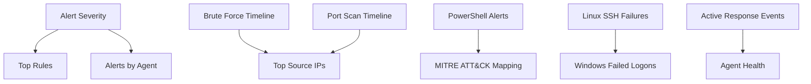

# Wazuh Unified Dashboard Guide

## 1. Can You Monitor Everything in One Dashboard?

Yes. The current Wazuh dashboard supports:

- security event monitoring
- threat hunting
- agent status visibility
- built-in dashboards for endpoint security and MITRE ATT&CK
- custom visualizations and custom dashboards

That means you can monitor:

- `Windows 10` logs and Sysmon events
- `Linux` auth logs
- brute-force alerts
- port-scan alerts
- suspicious PowerShell alerts
- agent health
- optional Active Response events

## 2. Recommended Dashboard Design

Create one custom dashboard called:

- `SOC Lab Overview`

This should give you a single-pane view of the lab.

### Recommended Panels

1. `Alert volume by severity`
2. `Top triggering rules`
3. `Alerts by agent`
4. `Brute-force alerts over time`
5. `Port-scan alerts over time`
6. `Suspicious PowerShell alerts`
7. `Top source IPs`
8. `Linux SSH failures`
9. `Windows failed logons`
10. `Recent active response events`
11. `MITRE ATT&CK techniques observed`
12. `Agent health status`

## 3. Suggested Layout

## 4. What to Monitor on the Dashboard

### Global SOC View

Use panels for:

- total alerts in last `24 hours`
- alert severity trend
- alerts by host
- top alert rules

### Brute Force Monitoring

Use filters for:

- rule IDs for Windows brute force
- rule IDs for Linux SSH brute force
- source IP frequency
- targeted usernames

### Port Scan Monitoring

Use filters for:

- your custom `port scan` rule ID
- source IP
- destination port count
- victim host

### Suspicious PowerShell Monitoring

Use filters for:

- Sysmon event ID `1`
- custom PowerShell rule ID
- process image
- command line

### Active Response Monitoring

Track:

- active response actions triggered
- blocked source IPs
- affected host
- time of action

## 5. How to Build the Custom Dashboard

According to current Wazuh documentation, the workflow is:

1. go to `Explore > Visualize`
2. create individual visualizations
3. select the relevant index pattern
4. save each visualization
5. go to `Explore > Dashboards`
6. create a new dashboard
7. add the saved visualizations

Recommended data source:

- the Wazuh alerts index used by your deployment

Use whichever Wazuh alert index pattern is present in your dashboard environment.

## 6. Example Visualizations to Create

### Visualization 1: Alert Severity by Count

- type: bar or pie chart
- metric: count
- bucket: `rule.level`

### Visualization 2: Top Rules

- type: horizontal bar chart
- metric: count
- bucket: `rule.description.keyword`

### Visualization 3: Alerts by Agent

- type: bar chart
- metric: count
- bucket: `agent.name.keyword`

### Visualization 4: Brute Force Timeline

- type: line chart
- metric: count
- filter:
  - `rule.id:100101 OR rule.id:100131`

### Visualization 5: Port Scan Timeline

- type: line chart
- metric: count
- filter:
  - `rule.id:100111`

### Visualization 6: Suspicious PowerShell

- type: data table
- columns:
  - `@timestamp`
  - `agent.name`
  - `rule.description`
  - `data.win.eventdata.commandLine`

filter:

- `rule.id:100120`

### Visualization 7: Top Source IPs

- type: bar chart
- metric: count
- bucket: `data.srcip` or the matching source IP field in your indexed alerts

### Visualization 8: MITRE Techniques

- type: table or bar chart
- bucket: `rule.mitre.id`

### Visualization 9: Agent Health

Use the built-in Wazuh agent monitoring view for:

- connected agents
- disconnected agents
- last keepalive

## 7. Recommended Saved Searches

Create saved searches for:

- `Windows brute force`
  - `rule.id:100101`
- `Linux brute force`
  - `rule.id:100131`
- `Port scan`
  - `rule.id:100111`
- `Suspicious PowerShell`
  - `rule.id:100120`
- `All critical alerts`
  - `rule.level:[10 TO 16]`

These saved searches make triage faster and can also be reused in visualizations.

## 8. Best Dashboard Filters

Add quick filters for:

- last `15 minutes`
- last `1 hour`
- last `24 hours`
- `Windows only`
- `Linux only`
- `Kali source IP only`
- `high severity only`

Example lab filter values:

- `agent.name:"WIN10-VICTIM"`
- `agent.name:"linux-victim"`
- `data.srcip:"192.168.56.30"`

## 9. Recommended Final Dashboard Structure

Top row:

- alert count by severity
- top rules
- alerts by agent

Middle row:

- brute-force timeline
- port-scan timeline
- top source IPs

Bottom row:

- suspicious PowerShell events
- MITRE ATT&CK techniques
- recent active response events
- agent health snapshot

## 10. Practical Notes

- yes, the Wazuh dashboard can be your main monitoring dashboard for the whole lab
- for network telemetry from `Suricata` or `Zeek`, you can also ingest and visualize those events later
- once you add Linux and Active Response, the dashboard becomes much more useful because you can see both detection and containment in one place

## Sources

- [Wazuh dashboard overview](https://documentation.wazuh.com/current/getting-started/components/wazuh-dashboard.html)
- [Navigating the Wazuh dashboard](https://documentation.wazuh.com/current/user-manual/wazuh-dashboard/navigating-the-wazuh-dashboard.html)
- [Creating custom dashboards](https://documentation.wazuh.com/current/user-manual/wazuh-dashboard/creating-custom-dashboards.html)
